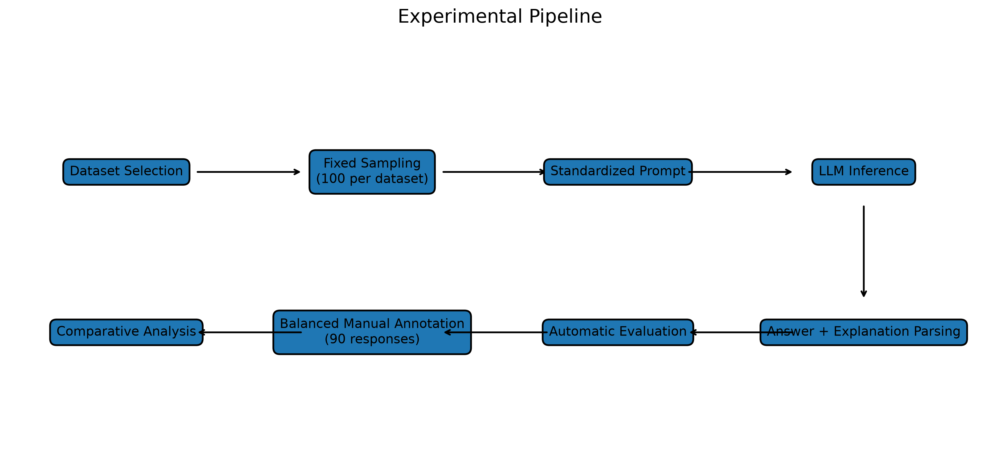
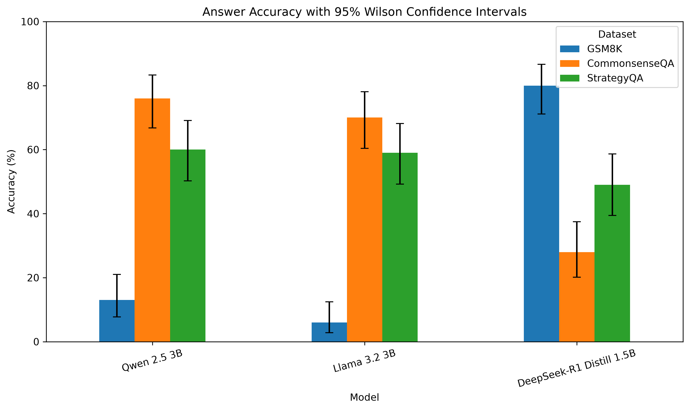
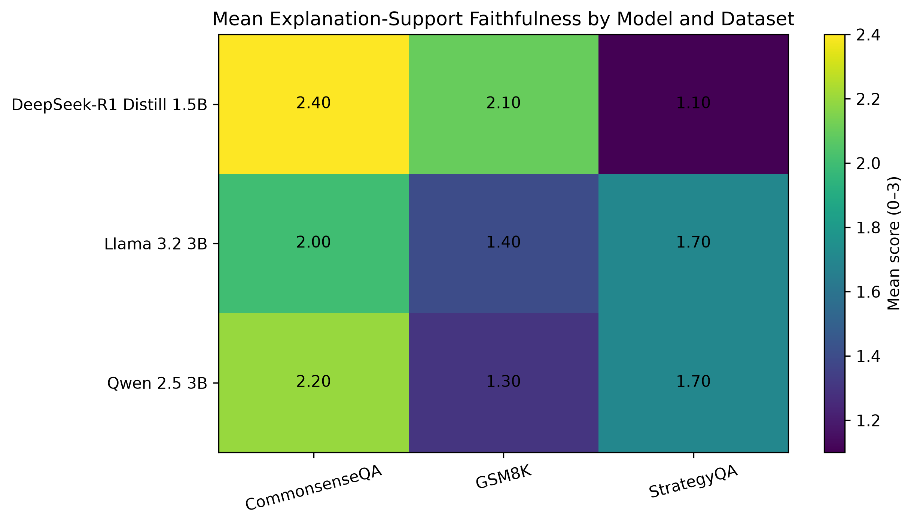
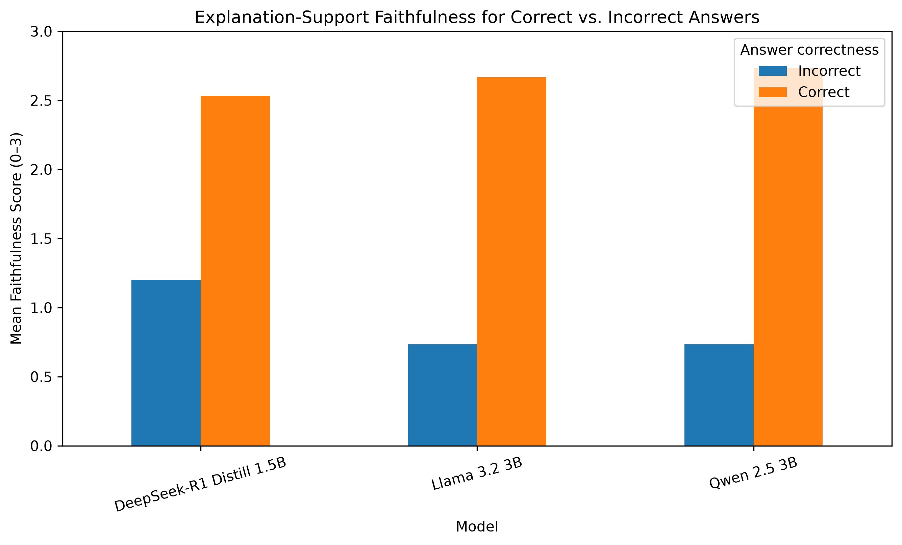
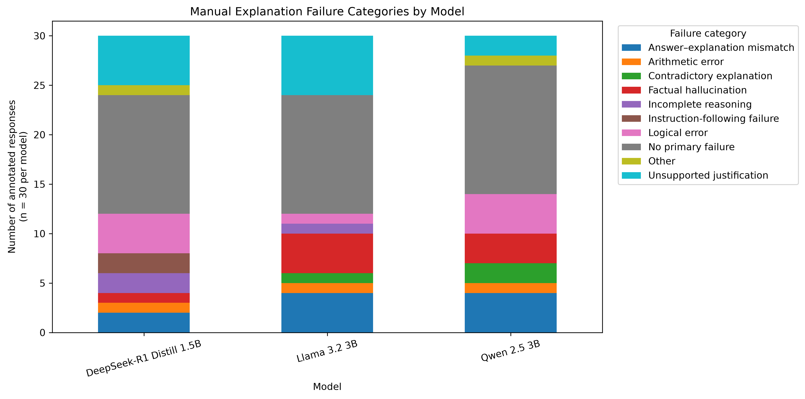

# Can We Trust LLM Self-Explanations? 
## An Empirical Evaluation of Explanation-Support Faithfulness in Open-Weight Large Language Models 

FaithfulLLM is a reproducible empirical study of whether natural-language explanations generated by compact open-weight Large Language Models provide reliable support for their final answers.

The project compares three instruction-tuned models across mathematical, commonsense, and multi-hop reasoning tasks using one shared prompting and evaluation pipeline. It combines automatic answer evaluation, strict output-format analysis, runtime measurement, balanced manual explanation review, statistical testing, and qualitative failure analysis.

> **Important interpretation:** this project evaluates **explanation-support faithfulness** at the behavioral level. It does not claim that a generated explanation reveals the hidden causal computation of the model.

---

## Research Questions

The study addresses four research questions:

1. **RQ1:** How does answer accuracy vary across models and reasoning tasks?
2. **RQ2:** How reliably do the models follow the required answer–explanation output format?
3. **RQ3:** How does explanation-support faithfulness vary by model, dataset, and answer correctness?
4. **RQ4:** Which explanation failure patterns occur most frequently?

The analysis tests three hypotheses:

- **H1:** Model performance is task-specific rather than uniform across datasets.
- **H2:** Correct answers are accompanied by higher explanation-support faithfulness than incorrect answers.
- **H3:** A reasoning-oriented model may obtain stronger mathematical performance at the cost of longer runtime and weaker format compliance.

---

## Models

| Short name | Hugging Face model |
|---|---|
| Qwen 2.5 3B | `Qwen/Qwen2.5-3B-Instruct` |
| Llama 3.2 3B | `meta-llama/Llama-3.2-3B-Instruct` |
| DeepSeek-R1 Distill 1.5B | `deepseek-ai/DeepSeek-R1-Distill-Qwen-1.5B` |

All models were loaded using 4-bit NF4 quantization so that the experiments could run on a 4 GB consumer GPU.

---

## Datasets

The benchmark contains 100 fixed examples from each dataset:

| Dataset | Task type | Split used | Samples |
|---|---|---:|---:|
| GSM8K | Mathematical word problems | Test | 100 |
| CommonsenseQA | Five-option commonsense reasoning | Validation | 100 |
| StrategyQA | Multi-hop yes/no reasoning | Available training split | 100 |

Sampling used random seed `42`. The same 300 questions were presented to every model.

Total generations:

```text
3 models × 3 datasets × 100 samples = 900 responses
```

---

## Standardized Output Format

Every model received the same answer–explanation instruction and was required to return:

```text
FINAL_ANSWER: <answer>
EXPLANATION: <concise justification>
```

Expected final-answer formats:

- **GSM8K:** numerical answer
- **CommonsenseQA:** selected option label
- **StrategyQA:** yes/no answer

The final answer was requested before the explanation to support consistent extraction and parsing.

---

## Experimental Pipeline



The pipeline consists of:

1. benchmark preparation;
2. fixed sample selection;
3. standardized prompt construction;
4. model inference;
5. answer and explanation parsing;
6. automatic scoring;
7. balanced manual annotation;
8. comparative statistical analysis;
9. paper figure generation.

---

## Evaluation

### Automatic metrics

The automatic evaluation measures:

- answer accuracy;
- strict parse success;
- generation time;
- explanation length.

Dataset-specific answer normalization is applied before comparison with ground truth.

### Manual explanation analysis

A balanced subset of 90 successfully parsed responses was reviewed:

```text
3 models × 3 datasets × 10 responses = 90 reviewed responses
```

For each model–dataset combination, five correct and five incorrect answers were selected whenever possible.

Each explanation was scored from `0` to `3` on:

- **Explanation-support faithfulness:** whether the explanation correctly supports the stated final answer;
- **Logical consistency:** whether the reasoning is coherent and free from contradiction;
- **Completeness:** whether sufficient reasoning is provided.

A primary failure category was also assigned:

- answer–explanation mismatch;
- arithmetic error;
- contradictory explanation;
- factual hallucination;
- incomplete reasoning;
- instruction-following failure;
- logical error;
- unsupported justification;
- other;
- no primary failure.

### Statistical analysis

The analysis uses:

- Wilson 95% confidence intervals for accuracy;
- two-sided Mann–Whitney U tests;
- Cliff's delta;
- bootstrap confidence intervals with 10,000 resamples.

---

## Main Results

### Accuracy, format compliance, and runtime

| Model | GSM8K | CommonsenseQA | StrategyQA | Overall | Parse success | Mean time |
|---|---:|---:|---:|---:|---:|---:|
| Qwen 2.5 3B | 13% | 76% | 60% | 49.67% | 99.33% | 10.21 s |
| Llama 3.2 3B | 6% | 70% | 59% | 45.00% | 100.00% | 7.57 s |
| DeepSeek-R1 Distill 1.5B | 80% | 28% | 49% | 52.33% | 85.67% | 37.01 s |

Key observations:

- DeepSeek-R1 Distill achieved the strongest GSM8K accuracy.
- Qwen achieved the highest observed CommonsenseQA and StrategyQA accuracy.
- Llama achieved perfect strict-format compliance and the fastest mean generation time.
- Overall confidence intervals overlapped, so no model was universally superior.



### Mean manual explanation scores

| Model | Faithfulness | Logical consistency | Completeness |
|---|---:|---:|---:|
| DeepSeek-R1 Distill 1.5B | 1.87 | 2.07 | 2.03 |
| Llama 3.2 3B | 1.70 | 2.20 | 2.17 |
| Qwen 2.5 3B | 1.73 | 2.13 | 2.30 |

DeepSeek obtained the highest mean explanation-support faithfulness score, Llama the highest logical-consistency score, and Qwen the highest completeness score.



### Correct versus incorrect answers

Across all models:

- correct-answer explanations: **2.64**
- incorrect-answer explanations: **0.89**
- mean difference: **1.76**
- bootstrap 95% CI: **[1.42, 2.07]**
- Mann–Whitney U: **1827.0**
- `p < 0.001`
- Cliff's delta: **0.804**

This indicates a large association between answer correctness and visible explanation support.



### Failure patterns

Observed failure types included:

- unsupported justifications;
- factual hallucinations;
- arithmetic and logical errors;
- contradictory explanations;
- answer–explanation mismatches.



These results show that explanation fluency should not be treated as evidence of faithful internal reasoning.

---

## Repository Structure

```text
FaithfulLLM/
├── datasets/
│   └── processed/              # Fixed processed benchmark files
├── evaluation/                 # Evaluation and annotation outputs
├── experiments/                # Experiment configurations or run records
├── figures/                    # Paper-ready visualizations
├── outputs/                    # Generations, scores, and analysis outputs
├── src/                        # Main Python implementation
├── .gitignore
├── config.yaml                 # Project configuration
├── requirements.txt            # Python dependencies
├── RUN_COMMANDS.txt            # Reproduction commands
├── README.md
└── LICENSE
```

Important scripts in `src/` include:

```text
prepare_data.py
inspect_data.py
run_inference.py
parse_outputs.py
evaluate_answers.py
combine_results.py
create_annotation_sheet.py
select_balanced_annotations.py
analyze_manual_annotations.py
statistical_analysis.py
select_qualitative_examples.py
create_paper_figures.py
common.py
prompts.py
```

---

## Installation

### 1. Clone the repository

```bash
git clone https://github.com/Yash-Gavade/FaithfulLLM.git
cd FaithfulLLM
```

### 2. Create a virtual environment

Windows PowerShell:

```powershell
python -m venv .venv
.venv\Scripts\Activate.ps1
```

Linux/macOS:

```bash
python -m venv .venv
source .venv/bin/activate
```

### 3. Install dependencies

```bash
python -m pip install --upgrade pip
pip install -r requirements.txt
```

### 4. Authenticate with Hugging Face

Some models may require authentication or gated-model approval.

```bash
hf auth login
hf auth whoami
```

For Llama, request access to the relevant model repository before running inference.

---

## Hardware and Software Used

Final experiments were run with:

- Windows
- Python 3.11.2
- PyTorch 2.7.1
- CUDA 11.8
- NVIDIA GeForce GTX 1650 Ti
- 4 GB VRAM

Generation settings:

| Parameter | Value |
|---|---|
| Decoding | Greedy |
| Sampling | Disabled |
| Seed | 42 |
| Qwen max new tokens | 256 |
| Llama max new tokens | 256 |
| DeepSeek max new tokens | 768 |
| Quantization | 4-bit NF4 |
| Double quantization | Enabled |
| Compute type | Float16 |

DeepSeek used a larger token budget because shorter runs frequently ended before both required output fields were completed.

---

## Reproducing the Study

The repository includes `RUN_COMMANDS.txt`, which records the main project commands.

A typical workflow is:

### 1. Prepare the benchmark

```bash
python -m src.prepare_data
```

### 2. Inspect processed data

```bash
python -m src.inspect_data
```

### 3. Run model inference

```bash
python -m src.run_inference
```

Use the model and dataset arguments supported by the current script and configuration file.

### 4. Inspect generated outputs

```bash
python -m src.inspect_generations
```

### 5. Evaluate answers

```bash
python -m src.evaluate_answers
```

### 6. Combine model and dataset results

```bash
python -m src.combine_results
```

### 7. Create the manual annotation sample

```bash
python -m src.select_balanced_annotations
python -m src.create_annotation_sheet
```

### 8. Analyze manual annotations

```bash
python -m src.analyze_manual_annotations
```

### 9. Run statistical analysis

```bash
python -m src.statistical_analysis
```

### 10. Select qualitative examples

```bash
python -m src.select_qualitative_examples
```

### 11. Create paper figures

```bash
python -m src.create_paper_figures
```

Consult `RUN_COMMANDS.txt`, `config.yaml`, and each module's CLI help for exact arguments:

```bash
python -m src.run_inference --help
python -m src.evaluate_answers --help
```

---

## Benchmark Checksum

The SHA-256 checksum of the final processed benchmark CSV is:

```text
35b721529e523d4a945407053ded18d93489e5476a23ec90fad1923fb36906e5
```

The checksum can be used to confirm that the same fixed 300-question benchmark is being evaluated.

---

## Reproducibility Notes

Generated records preserve, where available:

- model identifier;
- dataset name;
- sample identifier;
- complete prompt;
- raw generation;
- parsed final answer;
- extracted explanation;
- ground-truth answer;
- correctness label;
- generation time;
- strict parse status;
- processing error field.

Outputs are written incrementally so interrupted inference can resume without regenerating completed samples.

---

## Interpretation of Faithfulness

This repository uses the term **explanation-support faithfulness**.

It asks whether the visible explanation:

- supports the visible final answer;
- is logically consistent;
- contains sufficient reasoning;
- avoids unsupported or contradictory claims.

It does **not** establish whether the explanation is causally identical to the model's hidden internal computation. Stronger causal claims would require intervention-based or mechanistic analysis.

---

## Limitations

- Only three compact open-weight models were evaluated.
- The benchmark contains 100 examples per dataset.
- Manual analysis covers 90 responses.
- Annotation was conducted through one reviewed structured process.
- No inter-annotator agreement was measured.
- All models were evaluated using 4-bit quantization.
- DeepSeek used a larger token budget than Qwen and Llama.
- One prompt structure and greedy decoding were used.
- StrategyQA was evaluated using an available training split rather than an untouched official test split.
- Results should not be generalized beyond the evaluated models, samples, and settings.

---

## Responsible Use

Self-generated explanations should be treated as inspectable behavioral justifications, not as proof of a model's internal reasoning.

For high-stakes applications, generated explanations should be combined with:

- independent answer verification;
- answer–explanation consistency checks;
- uncertainty estimation;
- calibration;
- retrieval or evidence grounding;
- domain-specific human review.

---

## Project Status

The full experimental pipeline has been completed for:

- Qwen 2.5 3B Instruct
- Llama 3.2 3B Instruct
- DeepSeek-R1 Distill Qwen 1.5B
- GSM8K
- CommonsenseQA
- StrategyQA

The repository contains the implementation, experiment artifacts, evaluation outputs, analysis scripts, and result figures used for the associated term paper.

---

## Citation

A formal citation will be added after publication or archival release of the paper.

For now, please cite the repository as:

```bibtex
@misc{gavade2026faithfulllm,
  author       = {Gavade, Yash Sakharam},
  title        = {FaithfulLLM: An Empirical Evaluation of Explanation-Support
                  Faithfulness in Open-Weight Large Language Models},
  year         = {2026},
  howpublished = {\url{https://github.com/Yash-Gavade/FaithfulLLM}},
  note         = {GitHub repository}
}
```

---

## Author

**Yash Sakharam Gavade**  
Computational Linguistics and Digital Humanities Department
Universität Trier, Germany

---

## License

This repository is released under the terms of the included [MIT License](LICENSE).

Third-party models and datasets remain subject to their original licenses and terms of use.
