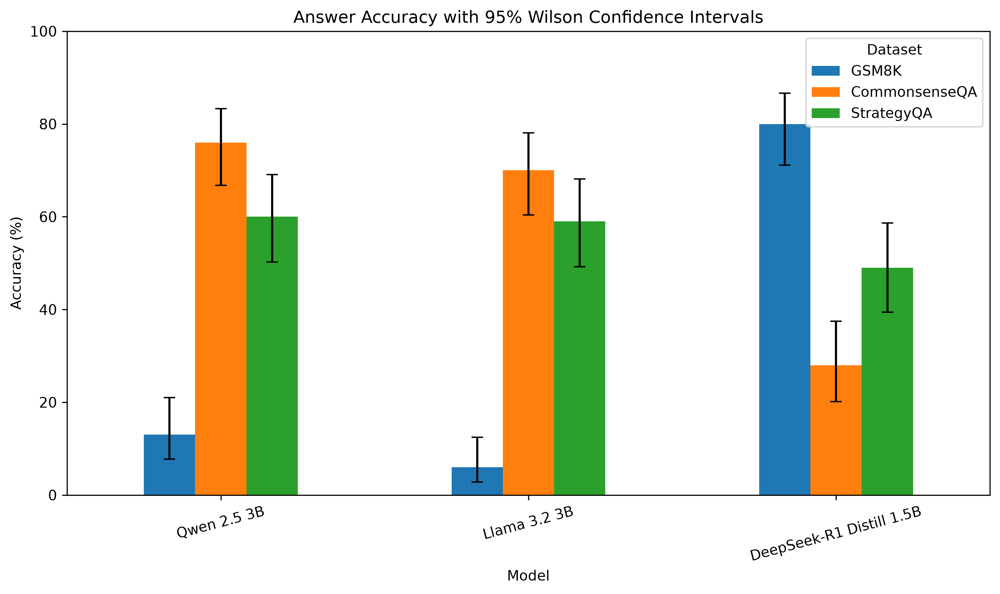
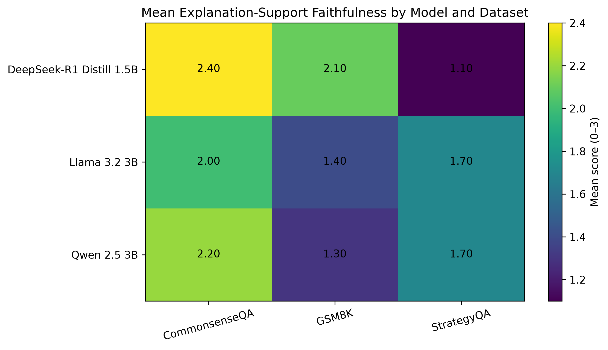
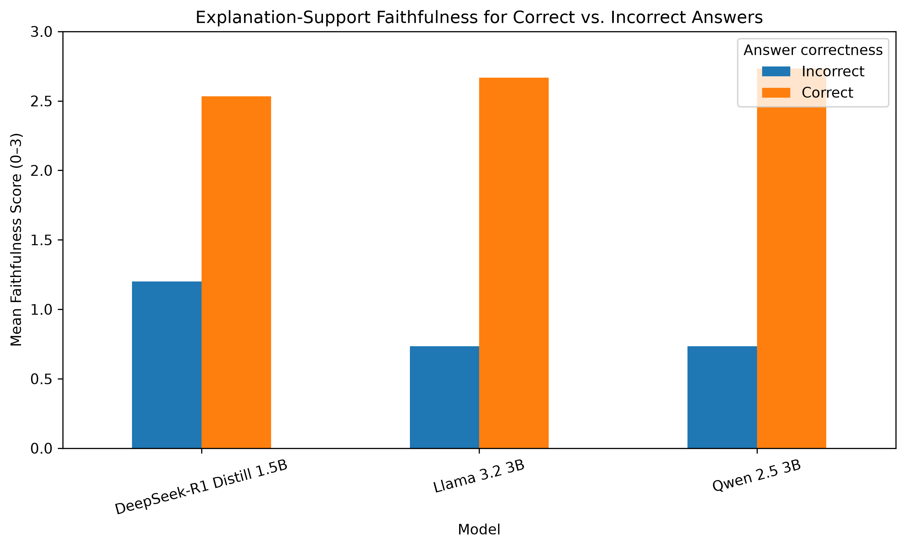
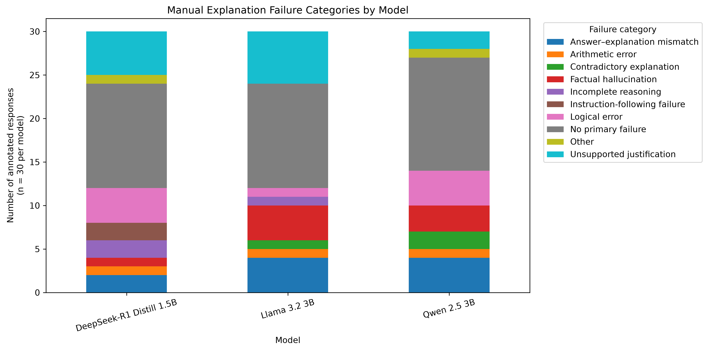

# Can We Trust LLM Self-Explanations?
### An Empirical Evaluation of Explanation-Support Faithfulness Across Reasoning Tasks

**FaithfulLLM** is a reproducible empirical study of whether natural-language explanations generated by compact open-weight Large Language Models provide reliable support for their final answers.

The project compares three instruction-tuned models across mathematical, commonsense, and multi-hop reasoning tasks using a shared prompting and evaluation pipeline. It combines automatic answer evaluation, strict output-format analysis, runtime measurement, balanced manual explanation review, statistical testing, and qualitative failure analysis.

> **Important interpretation:** This project evaluates **explanation-support faithfulness** at the behavioral level. It examines whether the visible explanation provides adequate support for the model's reported answer. It does not claim that a generated explanation reveals the hidden causal computation or internal reasoning process of the model.

---

## Research Questions

The study addresses four research questions:

1. **RQ1 — Answer Accuracy:** How does answer accuracy vary across models and reasoning tasks?
2. **RQ2 — Format Compliance:** How reliably do the models follow the required answer–explanation output format?
3. **RQ3 — Explanation-Support Faithfulness:** How does explanation-support faithfulness vary across models, datasets, and correct versus incorrect answers?
4. **RQ4 — Explanation Errors:** What types of explanation errors appear in the manually reviewed responses?

### Hypotheses

The study examines three hypotheses:

- **H1:** Model performance is expected to vary across reasoning tasks rather than remain uniform across datasets.
- **H2:** Explanations accompanying correct answers are expected to receive higher explanation-support faithfulness scores than explanations accompanying incorrect answers.
- **H3:** A reasoning-oriented model may achieve higher mathematical accuracy while requiring more generation time and showing lower output-format compliance.

---


## Models

| Short name | Hugging Face model |
|---|---|
| Qwen 2.5 3B | `Qwen/Qwen2.5-3B-Instruct` |
| Llama 3.2 3B | `meta-llama/Llama-3.2-3B-Instruct` |
| DeepSeek-R1 Distill 1.5B | `deepseek-ai/DeepSeek-R1-Distill-Qwen-1.5B` |

All three models were loaded using **4-bit NF4 quantization** so that the experiments could run locally on an NVIDIA GeForce GTX 1650 Ti GPU with **4 GB of VRAM**.

---

## Datasets

The evaluation uses **100 selected questions from each dataset**:

| Dataset | Task type | Split used | Samples |
|---|---|---|---:|
| GSM8K | Mathematical reasoning based on word problems | Test | 100 |
| CommonsenseQA | Five-option commonsense reasoning | Validation | 100 |
| StrategyQA | Multi-hop yes/no reasoning | Available training split | 100 |

Questions were selected using random seed `42`. The same 300 selected questions were presented to all three models so that the models were evaluated on the same inputs.

The complete experiment produced:

```text
3 models × 3 datasets × 100 questions = 900 responses


## Standardized Output Format

All three models received the same general answer–explanation instruction and were required to return:

```text
FINAL_ANSWER: <answer>
EXPLANATION: <concise justification>
```

The expected final-answer format depended on the dataset:

- **GSM8K:** numerical answer
- **CommonsenseQA:** option label (`A`–`E`)
- **StrategyQA:** `yes` or `no`

The final answer was requested before the explanation to support consistent extraction and parsing across models and datasets.

---

## Experimental Pipeline


The experimental pipeline consists of:

1. benchmark preparation and sample selection;
2. standardized prompt construction;
3. model inference;
4. answer and explanation parsing;
5. automatic evaluation of answer accuracy, strict format compliance, and generation time;
6. balanced manual explanation review;
7. statistical analysis of explanation-support faithfulness;
8. qualitative failure analysis;
9. paper figure generation.

---


## Evaluation

### Automatic Metrics

The automatic evaluation measures:

- **Answer accuracy:** whether the extracted final answer matches the reference answer after dataset-specific normalization;
- **Strict format compliance:** whether the response follows the required `FINAL_ANSWER:` and `EXPLANATION:` structure;
- **Generation time:** the recorded inference time for each response.

Dataset-specific answer normalization is applied before comparison with the reference answer. GSM8K answers are normalized numerically, CommonsenseQA predictions are mapped to option labels, and StrategyQA answers are normalized to yes/no labels.

### Manual Explanation Analysis

A balanced subset of **90 successfully parsed responses** was manually reviewed:

```text
3 models × 3 datasets × 10 responses = 90 reviewed responses
```

For each model–dataset combination, **five correct and five incorrect responses** were selected whenever possible. This balanced sample was designed to support comparison between correct and incorrect answers and should not be interpreted as a representative estimate of failure frequencies across all 900 responses.

Each explanation was scored from `0` to `3` on three dimensions:

- **Explanation-support faithfulness:** whether the explanation provides valid support for the stated final answer;
- **Logical consistency:** whether the reasoning is coherent and free from internal contradiction;
- **Completeness:** whether sufficient reasoning is provided to support the answer.

Where a failure was identified, one primary failure category was assigned:

- answer–explanation mismatch;
- arithmetic error;
- contradictory explanation;
- factual hallucination;
- incomplete reasoning;
- instruction-following failure;
- logical error;
- unsupported justification;
- other;
- no primary failure.

The manual analysis evaluates only the **visible generated explanation**. It does not determine whether the explanation reflects the model's hidden internal reasoning process.

### Statistical Analysis

The statistical analysis uses:

- **Wilson 95% confidence intervals** for accuracy estimates;
- **two-sided Mann–Whitney U tests** to compare faithfulness scores for correct and incorrect responses;
- **Cliff's delta** to quantify the effect size of this difference;
- **bootstrap 95% confidence intervals** for the mean faithfulness-score difference using `10,000` resamples and random seed `42`.

The statistical comparison concerns the association between **answer correctness and explanation-support faithfulness** within the manually reviewed sample. Because answer correctness is related to the faithfulness rubric, these results should not be interpreted as evidence that correctness causes faithful explanations or that the explanations reveal the model's internal causal reasoning.

---
## Main Results

### Accuracy, Format Compliance, and Runtime

| Model | GSM8K | CommonsenseQA | StrategyQA | Overall | Format compliance | Mean time |
|---|---:|---:|---:|---:|---:|---:|
| Qwen 2.5 3B | 13% | 76% | 60% | 49.67% | 99.33% | 10.21 s |
| Llama 3.2 3B | 6% | 70% | 59% | 45.00% | 100.00% | 7.57 s |
| DeepSeek-R1 Distill 1.5B | 80% | 28% | 49% | 52.33% | 85.67% | 37.01 s |

The results show clear task-dependent differences:

- **DeepSeek-R1 Distill** achieved the highest GSM8K accuracy at **80%**.
- **Qwen 2.5 3B** achieved the highest accuracy on CommonsenseQA (**76%**) and StrategyQA (**60%**).
- **Llama 3.2 3B** achieved **100% strict format compliance** and the shortest mean generation time at **7.57 seconds**.
- Overall accuracy was relatively close across the three models: **52.33%** for DeepSeek, **49.67%** for Qwen, and **45.00%** for Llama.

The results therefore show different strengths across tasks rather than one model performing best in every setting.



> **Runtime note:** Qwen and Llama used a maximum generation length of 256 tokens, while DeepSeek used 768 tokens after preliminary runs showed truncated outputs at the shorter limit. The runtime values therefore describe the final experimental configuration and should not be interpreted as a controlled equal-budget speed comparison.

### Mean Manual Explanation Scores

The balanced manual analysis covered **90 successfully parsed responses**, with 30 reviewed responses per model.

| Model | Faithfulness | Logical consistency | Completeness |
|---|---:|---:|---:|
| DeepSeek-R1 Distill 1.5B | 1.87 | 2.07 | 2.03 |
| Llama 3.2 3B | 1.70 | 2.20 | 2.17 |
| Qwen 2.5 3B | 1.73 | 2.13 | 2.30 |

Within the manually reviewed sample:

- **DeepSeek-R1 Distill** had the highest mean explanation-support faithfulness score (**1.87**).
- **Llama 3.2 3B** had the highest mean logical-consistency score (**2.20**).
- **Qwen 2.5 3B** had the highest mean completeness score (**2.30**).



The heatmap provides a more detailed view across model–dataset combinations. Each cell contains only **10 manually reviewed responses**, so these values are descriptive and should not be treated as precise population estimates.

### Correct Versus Incorrect Answers

The clearest difference in the manual analysis appeared between explanations accompanying correct and incorrect answers.

| Measure | Result |
|---|---:|
| Correct-answer mean faithfulness | **2.64** |
| Incorrect-answer mean faithfulness | **0.89** |
| Mean difference | **1.76** |
| Bootstrap 95% CI | **[1.42, 2.07]** |
| Mann–Whitney U | **1827.0** |
| p-value | **< 0.001** |
| Cliff's delta | **0.804** |

Explanations accompanying correct answers received substantially higher explanation-support faithfulness scores than explanations accompanying incorrect answers. The difference was statistically significant within the manually reviewed sample and was consistent with **H2**.



This result describes an association between answer correctness and explanation-support faithfulness. Because correctness is related to the faithfulness assessment itself, the result should not be interpreted as evidence that correctness causes faithful explanations or that the generated explanation reveals the model's hidden causal reasoning process.

### Qualitative Failure Analysis

The manually reviewed responses showed several recurring explanation problems:

- **Unsupported justifications:** conclusions were given without sufficient supporting reasoning.
- **Factual hallucinations:** explanations contained unsupported or incorrect factual claims.
- **Arithmetic and logical errors:** reasoning contained calculation or logical mistakes.
- **Contradictory explanations:** parts of the explanation conflicted with one another.
- **Answer–explanation mismatches:** the explanation did not adequately support the reported final answer.



In the reviewed sample, unsupported justifications were especially visible for DeepSeek and Llama. Factual hallucinations and answer–explanation mismatches appeared for Llama and Qwen, while contradictory explanations were additionally observed for Qwen.

> **Sampling note:** These failure counts come from the deliberately balanced **90-response manual sample**. They should not be interpreted as estimates of how frequently each failure occurs across all 900 generated responses.

Overall, the qualitative analysis shows that a fluent or plausible-looking explanation can still contain unsupported claims, contradictions, or reasoning errors. Generated explanations are therefore better treated as **inspectable evidence supporting a reported answer**, rather than as direct evidence of the model's internal reasoning process.

---
## Repository Structure

```text
FaithfulLLM/
├── datasets/
│   └── processed/              # Processed benchmark files
├── evaluation/                 # Manual annotation and evaluation files
├── experiments/                # Experiment configurations and run records
├── figures/                    # Figures used in the paper and analysis
├── outputs/                    # Model generations, scores, and analysis outputs
├── src/                        # Main Python implementation
├── .gitignore
├── config.yaml                 # Experiment configuration
├── requirements.txt            # Python dependencies
├── RUN_COMMANDS.txt            # Commands for reproducing the experiments
├── README.md
└── LICENSE
```

### Main Scripts

The main implementation is contained in `src/`. Important scripts include:

```text
prepare_data.py
inspect_data.py
run_inference.py
parse_outputs.py
evaluate_answers.py
combine_results.py
create_annotation_sheet.py
select_balanced_annotations.py
analyze_manual_annotations.py
statistical_analysis.py
select_qualitative_examples.py
create_paper_figures.py
common.py
prompts.py
```

These scripts cover the main stages of the workflow, including dataset preparation, model inference, output parsing, automatic evaluation, balanced manual-sample selection, statistical analysis, qualitative example selection, and figure generation.

---

## Installation

### 1. Clone the Repository

```bash
git clone https://github.com/Yash-Gavade/FaithfulLLM.git
cd FaithfulLLM
```

### 2. Create a Virtual Environment

**Windows PowerShell:**

```powershell
python -m venv .venv
.venv\Scripts\Activate.ps1
```

**Linux/macOS:**

```bash
python -m venv .venv
source .venv/bin/activate
```

### 3. Install Dependencies

```bash
python -m pip install --upgrade pip
pip install -r requirements.txt
```

### 4. Authenticate with Hugging Face

Some model repositories may require Hugging Face authentication or prior access approval.

```bash
hf auth login
hf auth whoami
```

For **Llama 3.2 3B Instruct**, access to the corresponding Hugging Face model repository must be available before running inference.

---

## Hardware and Software Used

The final experiments were run locally using the following environment:

- **Operating system:** Windows
- **Python:** 3.11.2
- **PyTorch:** 2.7.1
- **CUDA:** 11.8
- **GPU:** NVIDIA GeForce GTX 1650 Ti
- **VRAM:** 4 GB

### Generation Settings

| Parameter | Value |
|---|---|
| Decoding | Greedy |
| Sampling | Disabled |
| Seed | 42 |
| Qwen max new tokens | 256 |
| Llama max new tokens | 256 |
| DeepSeek max new tokens | 768 |
| Quantization | 4-bit NF4 |
| Double quantization | Enabled |
| Compute type | Float16 |

Qwen and Llama used a maximum generation length of 256 tokens. DeepSeek used 768 tokens because preliminary runs with the shorter limit frequently ended before both required output fields were completed.

Because the models were not evaluated under the same maximum generation length, the recorded generation times should be interpreted as measurements from the final experimental setup rather than as a controlled equal-budget speed comparison.

---

## Reproducing the Study

The repository includes `RUN_COMMANDS.txt`, which records the main commands used in the experimental workflow. Experiment settings and paths are also stored in `config.yaml`.

A typical workflow is described below.

### 1. Prepare the Benchmark

```bash
python -m src.prepare_data
```

This step prepares the selected benchmark questions used in the experiments.

### 2. Inspect the Processed Data

```bash
python -m src.inspect_data
```

This step checks the prepared benchmark before model inference.

### 3. Run Model Inference

```bash
python -m src.run_inference
```

Model, dataset, output-path, and generation settings should follow the configuration used for the corresponding experiment.

### 4. Inspect Generated Outputs

```bash
python -m src.inspect_generations
```

This optional inspection step can be used to review generated outputs before automatic evaluation.

### 5. Evaluate Answers

```bash
python -m src.evaluate_answers
```

This step extracts and evaluates final answers using the dataset-specific answer-processing rules.

### 6. Combine Results

```bash
python -m src.combine_results
```

This step combines the model and dataset outputs for subsequent analysis.

### 7. Create the Balanced Manual-Review Sample

```bash
python -m src.select_balanced_annotations
python -m src.create_annotation_sheet
```

The manual-review sample contains 90 successfully parsed responses, with 10 responses from each model–dataset combination and a balance of correct and incorrect responses whenever possible.

### 8. Analyze Manual Annotations

```bash
python -m src.analyze_manual_annotations
```

This step summarizes the manual scores for explanation-support faithfulness, logical consistency, completeness, and the assigned primary failure categories.

### 9. Run Statistical Analysis

```bash
python -m src.statistical_analysis
```

This step produces the statistical comparison between faithfulness scores for correct and incorrect responses.

### 10. Select Qualitative Examples

```bash
python -m src.select_qualitative_examples
```

This step selects representative responses for qualitative inspection and reporting.

### 11. Create Paper Figures

```bash
python -m src.create_paper_figures
```

This step generates the figures used for the final analysis and paper.

For the exact commands and experiment settings, consult:

- `RUN_COMMANDS.txt`
- `config.yaml`
- the corresponding modules in `src/`

---

## Benchmark Checksum

The SHA-256 checksum recorded for the final processed benchmark CSV is:

```text
35b721529e523d4a945407053ded18d93489e5476a23ec90fad1923fb36906e5
```

This checksum can be used to verify that the same processed **300-question benchmark** is being used for reproduction.

The benchmark contains:

```text
100 GSM8K + 100 CommonsenseQA + 100 StrategyQA = 300 questions
```

The same 300 selected questions were presented to all three models, producing a total of 900 model responses.

---

## Reproducibility Notes

Generated records preserve, where applicable:

- model identifier;
- dataset name;
- sample identifier;
- complete input prompt;
- raw model generation;
- extracted final answer;
- extracted explanation;
- reference answer;
- correctness label;
- generation time;
- strict format status;
- processing error information.

Model outputs were written incrementally during inference so that interrupted runs could be resumed without regenerating already completed samples.

The experimental pipeline preserves the original model generations alongside the parsed answers and explanations. This allows the automatic evaluation and manual analysis to be traced back to the corresponding raw model output.

---

## Interpretation of Faithfulness

This project uses the term **explanation-support faithfulness** to describe a behavioral property of the generated explanation.

The evaluation asks whether the visible explanation:

- provides valid support for the model's stated final answer;
- is logically consistent;
- contains sufficient reasoning to support the answer;
- avoids unsupported, contradictory, or erroneous claims.

This definition concerns the relationship between the **visible answer and visible explanation**. It does **not** establish that the generated explanation is causally identical to the model's hidden internal computation or reasoning process.

Testing stronger forms of causal faithfulness would require additional methods, such as intervention-based or mechanistic analysis, which are outside the scope of this study.

---


## Limitations

The results should be interpreted within the scope of the experimental design:

- **Model coverage:** Only three compact open-weight instruction-tuned models were evaluated.
- **Benchmark size:** The evaluation used 100 selected questions from each dataset, for a total of 300 questions.
- **Manual-review size:** The explanation analysis covered 90 responses rather than all 900 generated responses.
- **Balanced sampling:** The manual sample was deliberately balanced between correct and incorrect responses where possible. Failure counts from this sample should therefore not be interpreted as population-level frequencies.
- **Annotation process:** Manual evaluation was conducted through a single structured review process, and no inter-annotator agreement was measured.
- **Quantization:** All models were evaluated using 4-bit NF4 quantization to fit the available 4 GB GPU memory.
- **Generation budget:** DeepSeek used a maximum generation length of 768 tokens, compared with 256 tokens for Qwen and Llama. Runtime measurements are therefore not controlled equal-budget comparisons.
- **Prompting and decoding:** The study used one standardized prompt structure and greedy decoding. Other prompts or decoding strategies may produce different results.
- **StrategyQA split:** StrategyQA was evaluated using the available training split rather than an untouched official test split, so possible training-data contamination cannot be ruled out.
- **Faithfulness scope:** The study evaluates explanation-support faithfulness from visible model outputs. It does not establish whether the explanation reflects the model's hidden causal reasoning process.
- **Generalizability:** The findings should not be generalized beyond the evaluated models, datasets, selected samples, prompting setup, and inference configuration.

---

## Conclusion

This study evaluated whether natural-language self-explanations generated by compact open-weight LLMs provide reliable support for their reported answers. Three models—Qwen 2.5 3B Instruct, Llama 3.2 3B Instruct, and DeepSeek-R1 Distill Qwen 1.5B—were evaluated on GSM8K, CommonsenseQA, and StrategyQA, producing **900 model responses**. A balanced subset of **90 responses** was then manually reviewed for explanation-support faithfulness, logical consistency, completeness, and qualitative failure patterns.

The main findings are:

- **Model performance was task-dependent.** DeepSeek-R1 Distill performed best on GSM8K, while Qwen achieved the highest accuracy on CommonsenseQA and StrategyQA.
- **Output behavior also differed across models.** Llama achieved 100% strict format compliance and the shortest observed mean generation time, while DeepSeek required a larger generation budget and showed lower format compliance.
- **Correct answers were associated with stronger explanation support.** Mean explanation-support faithfulness was **2.64** for correct answers and **0.89** for incorrect answers in the manually reviewed sample.
- **Explanation failures remained visible across models.** These included unsupported justifications, factual hallucinations, arithmetic and logical errors, contradictions, and answer–explanation mismatches.

Overall, the results suggest that self-generated explanations can provide useful additional evidence for inspecting a model's reported answer, but they should not be treated as proof that the model followed the reasoning expressed in the explanation.

The study therefore distinguishes **visible explanation support** from **internal causal faithfulness**. The experiments evaluate the former; determining whether an explanation reflects the model's actual internal computation would require additional causal or mechanistic analysis.

---

## Responsible Interpretation and Use

Generated self-explanations should be treated as **inspectable behavioral justifications**, not as proof of a model's internal reasoning.

A fluent and convincing explanation may still contain unsupported claims, contradictions, factual errors, or reasoning mistakes. Explanation quality should therefore be considered together with independent evidence about answer correctness.

For applications where incorrect or misleading outputs could have important consequences, additional safeguards may include:

- independent answer verification;
- answer–explanation consistency checks;
- uncertainty estimation and calibration;
- retrieval or external evidence grounding;
- task-specific validation;
- domain-specific human review.

The results of this project should therefore be interpreted as an evaluation of how well generated explanations support reported answers under the tested conditions, rather than as evidence that natural-language explanations expose the internal reasoning process of an LLM.

---

## Project Status

The experimental study is complete for the following models:

- **Qwen 2.5 3B Instruct**
- **Llama 3.2 3B Instruct**
- **DeepSeek-R1 Distill Qwen 1.5B**

and the following reasoning datasets:

- **GSM8K**
- **CommonsenseQA**
- **StrategyQA**

The completed experiment contains:

```text
3 models × 3 datasets × 100 questions = 900 model responses
```

The repository contains the code and artifacts required to document and reproduce the experimental workflow, including:

- benchmark preparation;
- model inference;
- output parsing;
- automatic answer evaluation;
- balanced manual-review preparation;
- manual annotation analysis;
- statistical analysis;
- qualitative example selection;
- result tables and figures.

These materials accompany the associated term paper:

> **Can We Trust LLM Self-Explanations? An Empirical Evaluation of Explanation-Support Faithfulness Across Reasoning Tasks**

---

## Author

**Yash Gavade**  
M.Sc. Natural Language Processing  
Universität Trier  
Trier, Germany

---

## License

This repository is released under the terms of the included [MIT License](LICENSE).

Third-party models, datasets, and other external resources remain subject to their respective licenses, access conditions, and terms of use.
